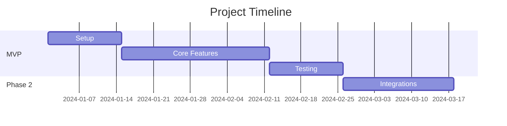
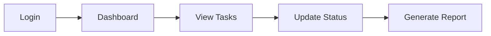
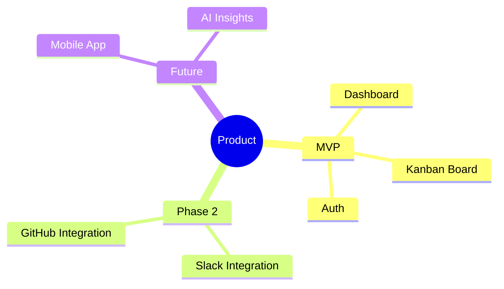

# Guided PRD Builder Phase 4: Timeline & Diagrams

> **For agentic workers:** REQUIRED SUB-SKILL: Use superpowers:subagent-driven-development (recommended) or superpowers:executing-plans to implement this plan task-by-task.

**Goal:** Add Timeline/Gantt visualization and auto-generated diagrams (user journey, feature hierarchy, architecture) with export capabilities.

**Architecture:** Backend endpoints to generate Mermaid diagram code from PRD content. Frontend components to render Mermaid diagrams and Timeline/Gantt view. Diagram export to PNG/SVG.

**Tech Stack:** .NET 8.0, FastEndpoints, MediatR, React 18, TypeScript 5, Mermaid.js, html-to-image

## Global Constraints

- Use Mermaid.js for diagram rendering
- All diagram endpoints require JWT authentication
- Diagrams are generated on-demand, not stored in DB (regenerated from current PRD state)
- Backend port: 5153, Frontend port: 5173
- Follow existing rustic theme (stone/amber colors)

---

### Task 1: Timeline Entity and API

**Files:**
- Create: `src/Backend/Braavo.Core/Entities/TimelinePhase.cs`
- Create: `src/Backend/Braavo.Core/Entities/Milestone.cs`
- Create: `src/Backend/Braavo.Core/UseCases/Timeline/GetTimelineQuery.cs`
- Create: `src/Backend/Braavo.Core/UseCases/Timeline/UpdateTimelineCommand.cs`
- Create: `src/Backend/Braavo.Api/Endpoints/Timeline/GetTimelineEndpoint.cs`
- Create: `src/Backend/Braavo.Api/Endpoints/Timeline/UpdateTimelineEndpoint.cs`
- Create: `src/Backend/Braavo.Infrastructure/Persistence/Configurations/TimelinePhaseConfiguration.cs`
- Modify: `src/Backend/Braavo.Infrastructure/Persistence/BraavoDbContext.cs`

**Interfaces:**
- Produces: `GET /api/products/{id}/timeline` → TimelinePhase[]
- Produces: `PUT /api/products/{id}/timeline` → Update timeline phases

**Data Model:**
```csharp
public class TimelinePhase
{
    public Guid Id { get; private set; }
    public Guid ProductId { get; private set; }
    public string Name { get; private set; }  // "MVP", "Phase 2", etc.
    public int DurationWeeks { get; private set; }
    public DateTime? StartDate { get; private set; }
    public int SortOrder { get; private set; }
    public List<Milestone> Milestones { get; private set; }
}

public class Milestone
{
    public Guid Id { get; private set; }
    public Guid PhaseId { get; private set; }
    public string Name { get; private set; }
    public int WeekNumber { get; private set; }
    public string[] Deliverables { get; private set; }
    public string Status { get; private set; }  // "planned", "in-progress", "completed"
}
```

- [ ] Step 1: Create TimelinePhase and Milestone entities
- [ ] Step 2: Add EF Core configuration
- [ ] Step 3: Add DbSet to context
- [ ] Step 4: Create GetTimelineQuery and handler
- [ ] Step 5: Create UpdateTimelineCommand and handler
- [ ] Step 6: Create API endpoints
- [ ] Step 7: Run migration
- [ ] Step 8: Test endpoints
- [ ] Step 9: Commit

---

### Task 2: Generate Gantt Diagram Endpoint

**Files:**
- Create: `src/Backend/Braavo.Core/UseCases/Diagrams/GenerateGanttCommand.cs`
- Create: `src/Backend/Braavo.Api/Endpoints/Diagrams/GenerateGanttEndpoint.cs`

**Interfaces:**
- Consumes: `IProductRepository`, Timeline data
- Produces: `POST /api/products/{id}/diagrams/gantt` → Mermaid code string

**Implementation:**
- Fetch timeline phases and milestones
- Generate Mermaid Gantt syntax:


- [ ] Step 1: Create GenerateGanttCommand with handler
- [ ] Step 2: Implement Mermaid Gantt code generation
- [ ] Step 3: Create endpoint
- [ ] Step 4: Test with sample data
- [ ] Step 5: Commit

---

### Task 3: Generate User Journey Diagram Endpoint

**Files:**
- Create: `src/Backend/Braavo.Core/UseCases/Diagrams/GenerateUserJourneyCommand.cs`
- Create: `src/Backend/Braavo.Api/Endpoints/Diagrams/GenerateUserJourneyEndpoint.cs`

**Interfaces:**
- Consumes: `IProductRepository`, `IPersonaRepository`, `IUserStoryRepository`
- Produces: `POST /api/products/{id}/diagrams/user-journey` → Mermaid code

**Implementation:**
- Takes optional personaId parameter
- Fetch persona and their user stories
- Generate Mermaid flowchart showing journey:


- [ ] Step 1: Create GenerateUserJourneyCommand with handler
- [ ] Step 2: Implement journey flow generation from stories
- [ ] Step 3: Create endpoint
- [ ] Step 4: Test
- [ ] Step 5: Commit

---

### Task 4: Generate Feature Hierarchy Diagram Endpoint

**Files:**
- Create: `src/Backend/Braavo.Core/UseCases/Diagrams/GenerateFeatureHierarchyCommand.cs`
- Create: `src/Backend/Braavo.Api/Endpoints/Diagrams/GenerateFeatureHierarchyEndpoint.cs`

**Interfaces:**
- Consumes: `IProductRepository`, `IFeatureRepository`
- Produces: `POST /api/products/{id}/diagrams/feature-hierarchy` → Mermaid code

**Implementation:**
- Fetch all features grouped by phase
- Generate Mermaid mindmap or flowchart:


- [ ] Step 1: Create GenerateFeatureHierarchyCommand with handler
- [ ] Step 2: Implement hierarchy generation
- [ ] Step 3: Create endpoint
- [ ] Step 4: Test
- [ ] Step 5: Commit

---

### Task 5: Frontend Diagram API Client

**Files:**
- Create: `src/Frontend/src/api/diagrams.ts`

**Interfaces:**
- Produces: `diagramsApi` object with generate methods

```typescript
export const diagramsApi = {
  generateGantt: (productId: string) =>
    api.post<{ mermaidCode: string }>(`/products/${productId}/diagrams/gantt`),
  
  generateUserJourney: (productId: string, personaId?: string) =>
    api.post<{ mermaidCode: string }>(`/products/${productId}/diagrams/user-journey`, { personaId }),
  
  generateFeatureHierarchy: (productId: string) =>
    api.post<{ mermaidCode: string }>(`/products/${productId}/diagrams/feature-hierarchy`),
};
```

- [ ] Step 1: Create diagrams.ts API client
- [ ] Step 2: Add types
- [ ] Step 3: Commit

---

### Task 6: Mermaid Diagram Viewer Component

**Files:**
- Create: `src/Frontend/src/components/diagrams/MermaidDiagram.tsx`
- Create: `src/Frontend/src/components/diagrams/DiagramExport.tsx`

**Implementation:**
- Use mermaid.js to render diagrams
- DiagramExport provides PNG/SVG export buttons using html-to-image

```typescript
interface MermaidDiagramProps {
  code: string;
  id: string;
}

// Renders Mermaid diagram and provides ref for export
```

- [ ] Step 1: Install mermaid and html-to-image: `npm install mermaid html-to-image`
- [ ] Step 2: Create MermaidDiagram component
- [ ] Step 3: Create DiagramExport component with PNG/SVG buttons
- [ ] Step 4: Style with rustic theme
- [ ] Step 5: Test rendering
- [ ] Step 6: Commit

---

### Task 7: Timeline Page with Gantt View

**Files:**
- Create: `src/Frontend/src/pages/TimelinePage.tsx`
- Create: `src/Frontend/src/store/slices/timelineSlice.ts`
- Modify: `src/Frontend/src/App.tsx` (add route)
- Modify: `src/Frontend/src/store/store.ts` (add reducer)

**Implementation:**
- TimelinePage shows:
  1. Phase cards with milestones (editable)
  2. Generated Gantt diagram below
  3. Export buttons for the diagram

```typescript
// TimelinePage layout:
// - Header with "Timeline & Milestones"
// - Phase cards (Add/Edit/Delete phases)
// - Each phase shows milestones
// - "Generate Gantt" button
// - MermaidDiagram component with generated code
// - Export buttons
```

- [ ] Step 1: Create timelineSlice with CRUD thunks
- [ ] Step 2: Register in store
- [ ] Step 3: Create TimelinePage component
- [ ] Step 4: Add route `/products/:id/timeline`
- [ ] Step 5: Implement phase/milestone editing
- [ ] Step 6: Add Gantt generation and display
- [ ] Step 7: Test full flow
- [ ] Step 8: Commit

---

### Task 8: Diagrams Page

**Files:**
- Create: `src/Frontend/src/pages/DiagramsPage.tsx`
- Create: `src/Frontend/src/store/slices/diagramsSlice.ts`
- Modify: `src/Frontend/src/App.tsx` (add route)
- Modify: `src/Frontend/src/store/store.ts` (add reducer)

**Implementation:**
- DiagramsPage shows diagram type cards:
  1. User Journey - select persona, generate
  2. Feature Hierarchy - generate from features
  3. Timeline Gantt - link to timeline page
- Each generated diagram shows with export options

- [ ] Step 1: Create diagramsSlice with generate thunks
- [ ] Step 2: Register in store
- [ ] Step 3: Create DiagramsPage component
- [ ] Step 4: Add route `/products/:id/diagrams`
- [ ] Step 5: Implement diagram generation cards
- [ ] Step 6: Test all diagram types
- [ ] Step 7: Commit

---

### Task 9: Add Navigation Links

**Files:**
- Modify: `src/Frontend/src/pages/ProductDetailPage.tsx`

**Implementation:**
- Add Timeline and Diagrams to the PRD Sections grid on product detail page

- [ ] Step 1: Add Timeline section card (📅 icon)
- [ ] Step 2: Add Diagrams section card (📊 icon)
- [ ] Step 3: Update navigation
- [ ] Step 4: Test
- [ ] Step 5: Commit

---

### Task 10: Integration Testing

- [ ] Step 1: Start backend and frontend
- [ ] Step 2: Create a product with personas, stories, features
- [ ] Step 3: Add timeline phases and milestones
- [ ] Step 4: Generate each diagram type
- [ ] Step 5: Test export to PNG/SVG
- [ ] Step 6: Verify all navigation works
- [ ] Step 7: Fix any issues
- [ ] Step 8: Final commit

---

## Summary

Phase 4 delivers:
1. **Timeline entity and APIs** - Phases and milestones data model
2. **3 diagram generation endpoints** - Gantt, User Journey, Feature Hierarchy
3. **Mermaid rendering component** - Client-side diagram display
4. **Export functionality** - PNG and SVG export
5. **Timeline page** - Edit phases/milestones, view Gantt
6. **Diagrams page** - Generate and export all diagram types
