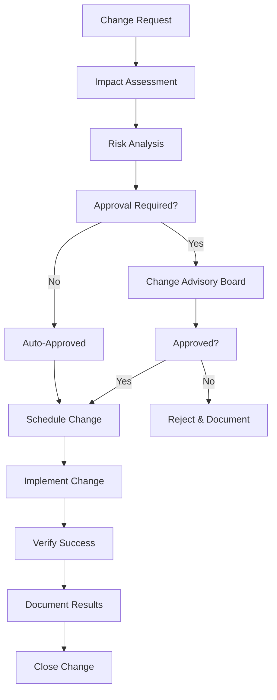

# Maintenance Phase Documentation

## 1. System Monitoring

### 1.1 Monitoring Stack

```
┌─────────────────────────────────────────────────────────────────┐
│                    Monitoring Architecture                       │
├─────────────────────────────────────────────────────────────────┤
│                                                                 │
│  ┌─────────────────────────────────────────────────────────────┐ │
│  │                   Application Layer                         │ │
│  │  ┌─────────────────┐    ┌─────────────────┐                │ │
│  │  │   Frontend      │    │   Backend API   │                │ │
│  │  │   (Metrics)     │    │   (Metrics)     │                │ │
│  │  └─────────────────┘    └─────────────────┘                │ │
│  └─────────────────────────┬───────────────────────────────────┘ │
│                            │                                     │
│  ┌─────────────────────────▼───────────────────────────────────┐ │
│  │                   Metrics Collection                        │ │
│  │  ┌─────────────────┐    ┌─────────────────┐                │ │
│  │  │   Prometheus    │    │   CloudWatch    │                │ │
│  │  │   (Metrics)     │    │   (AWS Metrics) │                │ │
│  │  └─────────────────┘    └─────────────────┘                │ │
│  └─────────────────────────┬───────────────────────────────────┘ │
│                            │                                     │
│  ┌─────────────────────────▼───────────────────────────────────┐ │
│  │                   Log Aggregation                           │ │
│  │  ┌─────────────────┐    ┌─────────────────┐                │ │
│  │  │   ELK Stack     │    │   CloudWatch    │                │ │
│  │  │   (Logs)        │    │   (Logs)        │                │ │
│  │  └─────────────────┘    └─────────────────┘                │ │
│  └─────────────────────────┬───────────────────────────────────┘ │
│                            │                                     │
│  ┌─────────────────────────▼───────────────────────────────────┐ │
│  │                   Visualization & Alerting                  │ │
│  │  ┌─────────────────┐    ┌─────────────────┐                │ │
│  │  │    Grafana      │    │   PagerDuty     │                │ │
│  │  │  (Dashboards)   │    │   (Alerting)    │                │ │
│  │  └─────────────────┘    └─────────────────┘                │ │
│  └─────────────────────────────────────────────────────────────┘ │
└─────────────────────────────────────────────────────────────────┘
```

### 1.2 Key Performance Indicators (KPIs)

#### Application Performance
```yaml
SLIs (Service Level Indicators):
  Availability:
    - Target: 99.9%
    - Measurement: Uptime percentage over 30 days
    - Alert: < 99.5% availability
  
  Response Time:
    - Target: 95th percentile < 2 seconds
    - Measurement: API endpoint response times
    - Alert: 95th percentile > 5 seconds
  
  Error Rate:
    - Target: < 0.1% of requests
    - Measurement: 5xx errors / total requests
    - Alert: > 1% error rate for 5 minutes
  
  Throughput:
    - Target: Handle 1000 requests/second
    - Measurement: Requests per second
    - Alert: < 50% of expected throughput

Business Metrics:
  User Engagement:
    - Daily Active Users (DAU)
    - Monthly Active Users (MAU)
    - User Retention Rate
    - Feature Adoption Rate
  
  Feature Usage:
    - PRDs Generated per Day
    - Wireframes Created per Day
    - Code Generations per Day
    - API Calls per Feature
  
  Revenue Metrics:
    - Monthly Recurring Revenue (MRR)
    - Customer Acquisition Cost (CAC)
    - Customer Lifetime Value (CLV)
    - Churn Rate
```

### 1.3 Monitoring Dashboards

#### System Health Dashboard
```yaml
# grafana/dashboards/system-health.json
{
  "dashboard": {
    "title": "Braavo System Health",
    "panels": [
      {
        "title": "System Uptime",
        "type": "stat",
        "targets": [
          {
            "expr": "up{job=\"braavo-api\"}"
          }
        ]
      },
      {
        "title": "Request Rate",
        "type": "graph",
        "targets": [
          {
            "expr": "rate(http_requests_total[5m])"
          }
        ]
      },
      {
        "title": "Error Rate",
        "type": "graph",
        "targets": [
          {
            "expr": "rate(http_requests_total{status_code=~\"5..\"}[5m])"
          }
        ]
      },
      {
        "title": "Response Time",
        "type": "graph",
        "targets": [
          {
            "expr": "histogram_quantile(0.95, rate(http_request_duration_seconds_bucket[5m]))"
          }
        ]
      }
    ]
  }
}
```

#### Business Metrics Dashboard
```yaml
# grafana/dashboards/business-metrics.json
{
  "dashboard": {
    "title": "Braavo Business Metrics",
    "panels": [
      {
        "title": "Daily Active Users",
        "type": "stat",
        "targets": [
          {
            "expr": "count(increase(user_login_total[1d]))"
          }
        ]
      },
      {
        "title": "PRDs Generated",
        "type": "graph",
        "targets": [
          {
            "expr": "increase(prd_generation_total[1d])"
          }
        ]
      },
      {
        "title": "Feature Usage",
        "type": "pie",
        "targets": [
          {
            "expr": "sum by (feature) (increase(feature_usage_total[1d]))"
          }
        ]
      },
      {
        "title": "Revenue Metrics",
        "type": "table",
        "targets": [
          {
            "expr": "subscription_revenue_total"
          }
        ]
      }
    ]
  }
}
```

## 2. Change Management

### 2.1 Change Management Process

#### Change Request Workflow


#### Change Categories
```yaml
Change Types:
  Emergency:
    - Definition: Critical fixes for production issues
    - Approval: CTO or on-call engineer
    - Implementation: Immediate
    - Examples: Security patches, critical bugs
  
  Standard:
    - Definition: Pre-approved, low-risk changes
    - Approval: Team lead
    - Implementation: Next deployment window
    - Examples: Feature updates, configuration changes
  
  Major:
    - Definition: High-risk or significant changes
    - Approval: Change Advisory Board
    - Implementation: Planned maintenance window
    - Examples: Architecture changes, major releases
  
  Normal:
    - Definition: Regular business changes
    - Approval: Product manager
    - Implementation: Regular deployment cycle
    - Examples: UI updates, content changes
```

### 2.2 Release Management

#### Release Process
```typescript
// scripts/release-manager.ts
export interface ReleaseConfig {
  version: string;
  environment: 'staging' | 'production';
  features: string[];
  bugfixes: string[];
  breaking_changes: string[];
  rollback_plan: string;
}

export class ReleaseManager {
  async executeRelease(config: ReleaseConfig): Promise<void> {
    console.log(`Starting release ${config.version} to ${config.environment}`);
    
    try {
      // Pre-release checks
      await this.preReleaseChecks(config);
      
      // Database migrations
      await this.runMigrations(config);
      
      // Deploy application
      await this.deployApplication(config);
      
      // Post-deployment verification
      await this.verifyDeployment(config);
      
      // Update monitoring
      await this.updateMonitoring(config);
      
      console.log(`Release ${config.version} completed successfully`);
    } catch (error) {
      console.error(`Release ${config.version} failed:`, error);
      await this.initiateRollback(config);
      throw error;
    }
  }

  private async preReleaseChecks(config: ReleaseConfig): Promise<void> {
    // Health checks
    await this.runHealthChecks();
    
    // Security scan
    await this.runSecurityScan();
    
    // Performance tests
    await this.runPerformanceTests();
    
    // Dependency checks
    await this.checkDependencies();
  }

  private async runMigrations(config: ReleaseConfig): Promise<void> {
    if (config.environment === 'production') {
      // Create database backup
      await this.createDatabaseBackup();
    }
    
    // Run migrations
    await this.executeMigrations();
  }

  private async deployApplication(config: ReleaseConfig): Promise<void> {
    // Blue-green deployment
    await this.deployToBlueEnvironment(config);
    await this.runSmokeTests();
    await this.switchTrafficToBlue();
  }

  private async verifyDeployment(config: ReleaseConfig): Promise<void> {
    // Verify all services are healthy
    await this.checkServiceHealth();
    
    // Verify feature flags
    await this.verifyFeatureFlags();
    
    // Run integration tests
    await this.runIntegrationTests();
  }

  private async initiateRollback(config: ReleaseConfig): Promise<void> {
    console.log('Initiating rollback procedure...');
    
    // Switch traffic back to green environment
    await this.switchTrafficToGreen();
    
    // Rollback database if needed
    if (config.environment === 'production') {
      await this.rollbackDatabase();
    }
    
    // Notify stakeholders
    await this.notifyRollback(config);
  }
}
```

### 2.3 Rollback Procedures

#### Automated Rollback
```bash
#!/bin/bash
# scripts/rollback.sh

set -e

ENVIRONMENT=$1
PREVIOUS_VERSION=$2

if [ -z "$ENVIRONMENT" ] || [ -z "$PREVIOUS_VERSION" ]; then
    echo "Usage: $0 <environment> <previous_version>"
    exit 1
fi

echo "Initiating rollback to version $PREVIOUS_VERSION in $ENVIRONMENT..."

# Stop health checks temporarily
aws elbv2 modify-target-group --target-group-arn $TARGET_GROUP_ARN --health-check-enabled false

# Deploy previous version
aws ecs update-service --cluster braavo-$ENVIRONMENT --service braavo-api-$ENVIRONMENT --task-definition braavo-api:$PREVIOUS_VERSION

# Wait for rollback to complete
aws ecs wait services-stable --cluster braavo-$ENVIRONMENT --services braavo-api-$ENVIRONMENT

# Rollback database if needed
if [ "$ENVIRONMENT" = "production" ]; then
    echo "Rolling back database..."
    # Restore from backup
    aws rds restore-db-instance-from-db-snapshot --db-instance-identifier braavo-prod-rollback --db-snapshot-identifier braavo-prod-pre-release
fi

# Re-enable health checks
aws elbv2 modify-target-group --target-group-arn $TARGET_GROUP_ARN --health-check-enabled true

# Verify rollback
sleep 30
curl -f https://api.$ENVIRONMENT.braavo.com/health

echo "Rollback completed successfully"

# Notify team
curl -X POST -H 'Content-type: application/json' \
    --data '{"text":"🔄 Rollback completed for '$ENVIRONMENT' environment to version '$PREVIOUS_VERSION'"}' \
    $SLACK_WEBHOOK_URL
```

## 3. Incident Management

### 3.1 Incident Response Process

#### Incident Classification
```yaml
Severity Levels:
  P0 - Critical:
    - Definition: Complete system outage
    - Response Time: 15 minutes
    - Resolution Time: 1 hour
    - Examples: Site down, data loss, security breach
  
  P1 - High:
    - Definition: Major feature unavailable
    - Response Time: 1 hour
    - Resolution Time: 4 hours
    - Examples: AI service down, payment processing failure
  
  P2 - Medium:
    - Definition: Minor feature degradation
    - Response Time: 4 hours
    - Resolution Time: 24 hours
    - Examples: Slow response times, UI glitches
  
  P3 - Low:
    - Definition: Minor issues or feature requests
    - Response Time: 1 business day
    - Resolution Time: 1 week
    - Examples: Cosmetic bugs, feature improvements
```

#### Incident Response Runbook
```typescript
// scripts/incident-response.ts
export interface Incident {
  id: string;
  severity: 'P0' | 'P1' | 'P2' | 'P3';
  title: string;
  description: string;
  affected_services: string[];
  detected_at: Date;
  status: 'open' | 'investigating' | 'resolved' | 'closed';
}

export class IncidentManager {
  async createIncident(incident: Incident): Promise<void> {
    console.log(`Creating incident: ${incident.title}`);
    
    // Log incident
    await this.logIncident(incident);
    
    // Notify on-call team
    await this.notifyOnCallTeam(incident);
    
    // Create communication channels
    await this.createIncidentChannel(incident);
    
    // Start status page update
    await this.updateStatusPage(incident);
  }

  async escalateIncident(incidentId: string): Promise<void> {
    const incident = await this.getIncident(incidentId);
    
    // Escalate to next level
    await this.notifyEscalationTeam(incident);
    
    // Update incident severity if needed
    if (incident.severity === 'P1') {
      incident.severity = 'P0';
      await this.updateIncident(incident);
    }
  }

  async resolveIncident(incidentId: string, resolution: string): Promise<void> {
    const incident = await this.getIncident(incidentId);
    
    // Mark as resolved
    incident.status = 'resolved';
    await this.updateIncident(incident);
    
    // Update status page
    await this.updateStatusPage(incident);
    
    // Schedule post-mortem
    await this.schedulePostMortem(incident);
    
    // Notify stakeholders
    await this.notifyResolution(incident, resolution);
  }

  private async logIncident(incident: Incident): Promise<void> {
    // Log to incident management system
    await this.sendToIncidentDB(incident);
    
    // Log to metrics system
    await this.recordIncidentMetrics(incident);
  }

  private async notifyOnCallTeam(incident: Incident): Promise<void> {
    // PagerDuty integration
    await this.triggerPagerDutyAlert(incident);
    
    // Slack notification
    await this.sendSlackAlert(incident);
    
    // Email notification
    await this.sendEmailAlert(incident);
  }

  private async updateStatusPage(incident: Incident): Promise<void> {
    const statusMessage = this.generateStatusMessage(incident);
    
    // Update status page
    await this.updateStatusPageAPI(statusMessage);
    
    // Notify subscribers
    await this.notifyStatusPageSubscribers(incident);
  }
}
```

### 3.2 Post-Incident Analysis

#### Post-Mortem Template
```markdown
# Post-Mortem: [Incident Title]

## Incident Summary
- **Date**: [Date]
- **Duration**: [Duration]
- **Severity**: [P0/P1/P2/P3]
- **Impact**: [Description of impact]
- **Root Cause**: [Root cause summary]

## Timeline
| Time | Event |
|------|-------|
| 14:00 | Incident detected by monitoring |
| 14:15 | On-call engineer acknowledged |
| 14:30 | Root cause identified |
| 15:00 | Fix implemented |
| 15:15 | Service restored |
| 15:30 | Incident resolved |

## Root Cause Analysis
### What Happened
[Detailed description of the incident]

### Why It Happened
[Analysis of the root cause]

### Contributing Factors
- [Factor 1]
- [Factor 2]
- [Factor 3]

## Impact Assessment
### User Impact
- [Number of affected users]
- [Services affected]
- [Business impact]

### System Impact
- [Performance degradation]
- [Data integrity issues]
- [Service availability]

## Response Analysis
### What Went Well
- [Positive aspects of response]
- [Effective procedures]
- [Team coordination]

### What Could Be Improved
- [Areas for improvement]
- [Process gaps]
- [Tool limitations]

## Action Items
| Action | Owner | Due Date | Status |
|--------|-------|----------|--------|
| Implement better monitoring | DevOps | 2024-01-15 | Open |
| Update runbook | SRE | 2024-01-10 | In Progress |
| Add automated failover | Engineering | 2024-01-20 | Open |

## Lessons Learned
- [Key takeaway 1]
- [Key takeaway 2]
- [Key takeaway 3]

## Prevention Measures
- [Measure 1]
- [Measure 2]
- [Measure 3]
```

## 4. Performance Optimization

### 4.1 Performance Monitoring

#### Performance Metrics Collection
```typescript
// src/utils/performance-monitor.ts
export class PerformanceMonitor {
  private metrics: Map<string, number[]> = new Map();
  private alertThresholds: Map<string, number> = new Map();

  constructor() {
    this.setupDefaultThresholds();
  }

  private setupDefaultThresholds(): void {
    this.alertThresholds.set('api_response_time', 2000); // 2 seconds
    this.alertThresholds.set('database_query_time', 100); // 100ms
    this.alertThresholds.set('memory_usage', 80); // 80%
    this.alertThresholds.set('cpu_usage', 70); // 70%
  }

  recordMetric(name: string, value: number): void {
    if (!this.metrics.has(name)) {
      this.metrics.set(name, []);
    }
    
    this.metrics.get(name)!.push(value);
    
    // Check for threshold violations
    this.checkThreshold(name, value);
  }

  private checkThreshold(name: string, value: number): void {
    const threshold = this.alertThresholds.get(name);
    if (threshold && value > threshold) {
      this.triggerAlert(name, value, threshold);
    }
  }

  private triggerAlert(metric: string, value: number, threshold: number): void {
    console.warn(`Performance alert: ${metric} (${value}) exceeded threshold (${threshold})`);
    
    // Send to monitoring system
    this.sendToMonitoring({
      type: 'performance_alert',
      metric,
      value,
      threshold,
      timestamp: new Date()
    });
  }

  getMetricStats(name: string): {
    count: number;
    avg: number;
    min: number;
    max: number;
    p95: number;
    p99: number;
  } {
    const values = this.metrics.get(name) || [];
    if (values.length === 0) {
      return { count: 0, avg: 0, min: 0, max: 0, p95: 0, p99: 0 };
    }

    const sorted = values.sort((a, b) => a - b);
    const count = values.length;
    const avg = values.reduce((sum, val) => sum + val, 0) / count;
    const min = sorted[0];
    const max = sorted[count - 1];
    const p95 = sorted[Math.floor(count * 0.95)];
    const p99 = sorted[Math.floor(count * 0.99)];

    return { count, avg, min, max, p95, p99 };
  }
}
```

### 4.2 Performance Optimization Strategies

#### Database Optimization
```sql
-- Database performance queries
-- Slow query identification
SELECT 
    query,
    mean_time,
    calls,
    total_time,
    rows,
    100.0 * shared_blks_hit / nullif(shared_blks_hit + shared_blks_read, 0) AS hit_percent
FROM pg_stat_statements
ORDER BY mean_time DESC
LIMIT 10;

-- Index usage analysis
SELECT 
    schemaname,
    tablename,
    indexname,
    idx_scan,
    idx_tup_read,
    idx_tup_fetch
FROM pg_stat_user_indexes
WHERE idx_scan = 0
ORDER BY schemaname, tablename;

-- Table size analysis
SELECT 
    schemaname,
    tablename,
    pg_size_pretty(pg_total_relation_size(schemaname||'.'||tablename)) as size
FROM pg_tables
WHERE schemaname NOT IN ('information_schema', 'pg_catalog')
ORDER BY pg_total_relation_size(schemaname||'.'||tablename) DESC;
```

#### Application Optimization
```typescript
// src/optimizations/query-optimizer.ts
export class QueryOptimizer {
  private queryCache: Map<string, any> = new Map();
  private cacheExpiry: Map<string, number> = new Map();

  async optimizeQuery<T>(
    key: string,
    queryFn: () => Promise<T>,
    ttl: number = 300000 // 5 minutes
  ): Promise<T> {
    const now = Date.now();
    const expiry = this.cacheExpiry.get(key);
    
    // Check cache validity
    if (expiry && now < expiry && this.queryCache.has(key)) {
      return this.queryCache.get(key);
    }
    
    // Execute query
    const result = await queryFn();
    
    // Cache result
    this.queryCache.set(key, result);
    this.cacheExpiry.set(key, now + ttl);
    
    return result;
  }

  invalidateCache(pattern: string): void {
    for (const key of this.queryCache.keys()) {
      if (key.includes(pattern)) {
        this.queryCache.delete(key);
        this.cacheExpiry.delete(key);
      }
    }
  }
}

// Usage example
const optimizer = new QueryOptimizer();

export const getDocuments = async (userId: string) => {
  return optimizer.optimizeQuery(
    `user_documents_${userId}`,
    () => prisma.document.findMany({
      where: { createdBy: userId },
      include: { project: true }
    }),
    300000 // 5 minute cache
  );
};
```

## 5. Security Maintenance

### 5.1 Security Monitoring

#### Security Metrics
```typescript
// src/security/security-monitor.ts
export class SecurityMonitor {
  private securityEvents: SecurityEvent[] = [];
  private suspiciousIPs: Set<string> = new Set();
  private failedLoginAttempts: Map<string, number> = new Map();

  recordSecurityEvent(event: SecurityEvent): void {
    this.securityEvents.push(event);
    
    // Check for suspicious patterns
    this.analyzeSecurityEvent(event);
  }

  private analyzeSecurityEvent(event: SecurityEvent): void {
    switch (event.type) {
      case 'failed_login':
        this.handleFailedLogin(event);
        break;
      case 'suspicious_request':
        this.handleSuspiciousRequest(event);
        break;
      case 'unauthorized_access':
        this.handleUnauthorizedAccess(event);
        break;
    }
  }

  private handleFailedLogin(event: SecurityEvent): void {
    const ip = event.sourceIP;
    const attempts = this.failedLoginAttempts.get(ip) || 0;
    
    this.failedLoginAttempts.set(ip, attempts + 1);
    
    if (attempts >= 5) {
      this.blockIP(ip);
      this.alertSecurityTeam(event);
    }
  }

  private blockIP(ip: string): void {
    this.suspiciousIPs.add(ip);
    
    // Add to rate limiter blacklist
    this.addToBlacklist(ip);
  }

  private alertSecurityTeam(event: SecurityEvent): void {
    // Send immediate alert for critical security events
    this.sendSecurityAlert({
      severity: 'HIGH',
      event: event,
      timestamp: new Date(),
      action_required: true
    });
  }
}

interface SecurityEvent {
  type: 'failed_login' | 'suspicious_request' | 'unauthorized_access';
  sourceIP: string;
  userAgent: string;
  userId?: string;
  details: any;
  timestamp: Date;
}
```

### 5.2 Security Auditing

#### Automated Security Scanning
```yaml
# .github/workflows/security-scan.yml
name: Security Scan

on:
  schedule:
    - cron: '0 2 * * *' # Daily at 2 AM
  push:
    branches: [main]

jobs:
  security-scan:
    runs-on: ubuntu-latest
    
    steps:
      - name: Checkout code
        uses: actions/checkout@v3

      - name: Run Snyk security scan
        uses: snyk/actions/node@master
        env:
          SNYK_TOKEN: ${{ secrets.SNYK_TOKEN }}
        with:
          args: --severity-threshold=medium

      - name: Run OWASP ZAP scan
        uses: zaproxy/action-full-scan@v0.4.0
        with:
          target: 'https://staging.braavo.com'
          rules_file_name: '.zap/rules.tsv'
          cmd_options: '-a'

      - name: Run Semgrep scan
        uses: returntocorp/semgrep-action@v1
        with:
          config: >-
            p/security-audit
            p/secrets
            p/owasp-top-ten

      - name: Upload results
        uses: github/codeql-action/upload-sarif@v2
        with:
          sarif_file: results.sarif
```

## 6. Documentation Maintenance

### 6.1 Documentation Strategy

#### Documentation Types
```yaml
Technical Documentation:
  API Documentation:
    - OpenAPI specifications
    - Endpoint descriptions
    - Request/response examples
    - Authentication guides
  
  Architecture Documentation:
    - System architecture diagrams
    - Database schemas
    - Integration patterns
    - Deployment guides
  
  Operational Documentation:
    - Runbooks and procedures
    - Troubleshooting guides
    - Monitoring setup
    - Incident response procedures

User Documentation:
  User Guides:
    - Feature tutorials
    - Best practices
    - FAQ sections
    - Video tutorials
  
  API Documentation:
    - SDK documentation
    - Code examples
    - Integration guides
    - Rate limiting information

Developer Documentation:
  Setup Guides:
    - Local development setup
    - Testing procedures
    - Coding standards
    - Contribution guidelines
```

### 6.2 Documentation Automation

#### Automated Documentation Generation
```typescript
// scripts/generate-docs.ts
import { generateApiDocs } from './api-docs-generator';
import { generateArchitectureDocs } from './architecture-docs-generator';
import { generateUserDocs } from './user-docs-generator';

export class DocumentationGenerator {
  async generateAllDocs(): Promise<void> {
    console.log('Generating documentation...');
    
    try {
      // Generate API documentation
      await generateApiDocs();
      
      // Generate architecture documentation
      await generateArchitectureDocs();
      
      // Generate user documentation
      await generateUserDocs();
      
      // Update documentation site
      await this.updateDocumentationSite();
      
      console.log('Documentation generation completed');
    } catch (error) {
      console.error('Documentation generation failed:', error);
      throw error;
    }
  }

  private async updateDocumentationSite(): Promise<void> {
    // Build documentation site
    await this.buildDocumentationSite();
    
    // Deploy to documentation hosting
    await this.deployDocumentation();
  }
}

// Automated documentation update on code changes
export const setupDocumentationHooks = (): void => {
  // Listen for code changes
  process.on('code_change', async (files: string[]) => {
    const generator = new DocumentationGenerator();
    
    // Check if documentation needs updating
    const needsUpdate = files.some(file => 
      file.includes('src/') || 
      file.includes('api/') || 
      file.includes('schema/')
    );
    
    if (needsUpdate) {
      await generator.generateAllDocs();
    }
  });
};
```

## 7. Capacity Planning

### 7.1 Resource Monitoring

#### Capacity Metrics
```typescript
// src/monitoring/capacity-monitor.ts
export class CapacityMonitor {
  private resourceMetrics: Map<string, ResourceMetric[]> = new Map();
  private capacityThresholds: Map<string, number> = new Map();

  constructor() {
    this.setupCapacityThresholds();
  }

  private setupCapacityThresholds(): void {
    this.capacityThresholds.set('cpu_utilization', 70);
    this.capacityThresholds.set('memory_utilization', 80);
    this.capacityThresholds.set('disk_utilization', 75);
    this.capacityThresholds.set('network_utilization', 60);
    this.capacityThresholds.set('database_connections', 80);
  }

  recordResourceMetric(resource: string, metric: ResourceMetric): void {
    if (!this.resourceMetrics.has(resource)) {
      this.resourceMetrics.set(resource, []);
    }
    
    this.resourceMetrics.get(resource)!.push(metric);
    
    // Check capacity thresholds
    this.checkCapacityThreshold(resource, metric);
  }

  private checkCapacityThreshold(resource: string, metric: ResourceMetric): void {
    const threshold = this.capacityThresholds.get(resource);
    if (threshold && metric.utilization > threshold) {
      this.triggerCapacityAlert(resource, metric, threshold);
    }
  }

  private triggerCapacityAlert(resource: string, metric: ResourceMetric, threshold: number): void {
    console.warn(`Capacity alert: ${resource} utilization (${metric.utilization}%) exceeded threshold (${threshold}%)`);
    
    // Send capacity planning alert
    this.sendCapacityAlert({
      resource,
      current_utilization: metric.utilization,
      threshold,
      projected_capacity: this.calculateProjectedCapacity(resource),
      recommendation: this.getScalingRecommendation(resource, metric)
    });
  }

  private calculateProjectedCapacity(resource: string): number {
    const metrics = this.resourceMetrics.get(resource) || [];
    if (metrics.length < 2) return 0;
    
    // Calculate trend
    const recent = metrics.slice(-24); // Last 24 hours
    const trend = this.calculateTrend(recent);
    
    // Project capacity for next 7 days
    return trend * 7 * 24;
  }

  private getScalingRecommendation(resource: string, metric: ResourceMetric): string {
    switch (resource) {
      case 'cpu_utilization':
        return 'Consider scaling up CPU resources or adding more instances';
      case 'memory_utilization':
        return 'Consider increasing memory allocation or optimizing memory usage';
      case 'database_connections':
        return 'Consider increasing connection pool size or optimizing query performance';
      default:
        return 'Monitor resource usage and consider scaling';
    }
  }
}

interface ResourceMetric {
  timestamp: Date;
  utilization: number;
  available: number;
  total: number;
}
```

### 7.2 Scaling Strategies

#### Auto-scaling Configuration
```yaml
# Auto-scaling configuration
auto_scaling:
  frontend:
    min_instances: 2
    max_instances: 10
    target_cpu_utilization: 70
    target_memory_utilization: 80
    scale_up_cooldown: 300
    scale_down_cooldown: 600
    
  backend:
    min_instances: 3
    max_instances: 20
    target_cpu_utilization: 70
    target_memory_utilization: 80
    scale_up_cooldown: 300
    scale_down_cooldown: 600
    
  database:
    read_replicas:
      min: 1
      max: 5
      cpu_threshold: 80
      connection_threshold: 80
    
    storage:
      auto_scaling: true
      max_capacity: 1000
      target_utilization: 75
```

This comprehensive maintenance documentation provides the operational framework needed to keep the ChatPRD Clone platform running smoothly, secure, and performing optimally in production environments. 